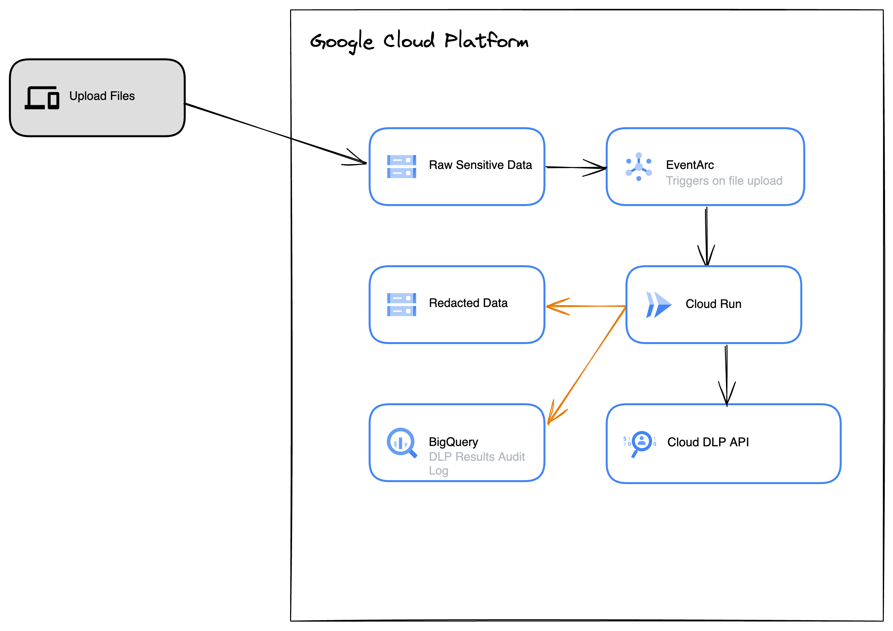

# Cloud DLP Demo

## Overview
This repository acts as a supportive resource to the blog post [**_"Cloud DLP as an essential security tool"_**](https://engineering.sada.com/cloud-dlp-as-an-essential-security-tool-33aef9a780d4) which is hosted on SADA's Engineering Blog Site. This blog was written by myself during my at SADA as a Solutions Architect. 

The blog discusses GCP Cloud DLP's features and capabilities as well as walks through a quick demonstration following the architecture highlighted below.



## Walkthrough

To set the necessary infrastructure to support the solution run the terraform configuration, as per the command below:

```
% cd ./terraform
% terraform plan & apply 
```

The terraform enable the necessary GCP APIs, create the following resources: 
* A GCP Bucket to store the raw/sensitive data
* A GCP Bucket to store the redacted data (output from Cloud DLP)
* A Cloud Function to run the python process which dynamically generates a Cloud DLP Job to process to the file in the raw bucket, redact any sensitive data, and store the redacted file in a secondary GCS bucket
* Configure the cloud function to trigger when a new file lands in the raw GCS bucket
* A BigQuery Dataset that stores the analysis output of the Cloud DLP processing

## Limitations

The following limitations of the code exists:
* Manually need to upload the file to GCS
* Code is deployed as a zip to v1 Cloud Functions
* InfoTypes for Cloud DLP are hard code in the python script


V2 of this repo is in the works..

Stay Tuned!